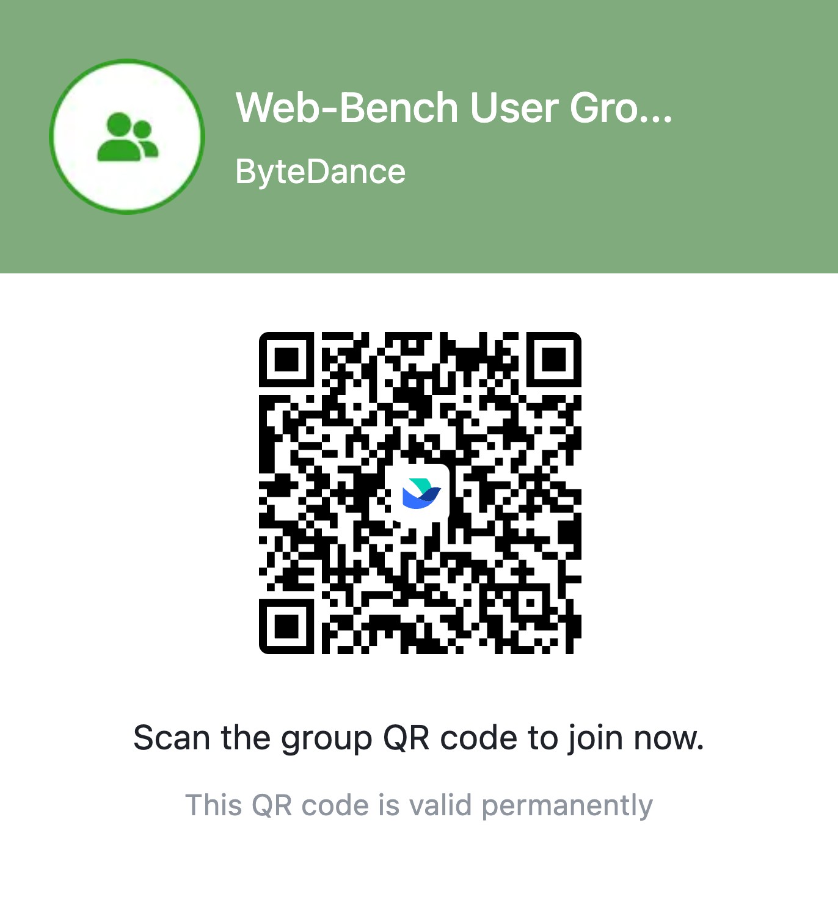

# Web-Bench

<p align="center">
    <a href="./README.zh_CN.md">中文</a> •
    <a href="#-installation">Install</a> •
    <a href="https://arxiv.org/abs/2505.07473">Paper</a> •
    <a href="https://huggingface.co/datasets/bytedance-research/Web-Bench">Datasets</a> •
    <a href="https://huggingface.co/spaces/bytedance-research/Web-Bench-Leaderboard">LeaderBoard</a> •
    <a href="#-citation">Citation</a>
</p>

## 📖 Overview

**Web-Bench** is a benchmark designed to evaluate the performance of LLMs in actual Web development. Web-Bench contains 50 projects, each consisting of 20 tasks with sequential dependencies. The tasks implement project features in sequence, simulating real-world human development workflows. When designing Web-Bench, we aim to cover the foundational elements of Web development: Web Standards and Web Frameworks. Given the scale and complexity of these projects, which were designed by engineers with 5-10 years of experience, each presents a significant challenge. On average, a single project takes 4–8 hours for a senior engineer to complete. On our given benchmark agent (Web-Agent), SOTA (Claude 3.7 Sonnet) achieves only 25.1\% Pass@1.

The distribution of the experimental data aligns well with the current code generation capabilities of mainstream LLMs.


HumanEval and MBPP have approached saturation. APPS and EvalPlus are approaching saturation. The SOTA for Web-Bench is 25.1\%, which is lower (better) than that of the SWE-bench Full and Verified sets.


## 🚀 Quick Start

Refer to the [Docker setup guide](https://docs.docker.com/engine/install/) for instructions on installing Docker on your machine

1. Create a new empty folder, add **two files** in this folder:

```
./config.json5
./docker-compose.yml
```

2. For `config.json5`, copy the json below and edit by [Config Parameters](https://github.com/bytedance/web-bench/wiki/Config-Parameters):

```json5
{
  models: [
    'openai/gpt-4o',
    // You can add more models here
    // "claude-sonnet-4-20250514"
  ],
  // Eval one project only
  // "projects": ["@web-bench/react"]
}
```

3. For `docker-compose.yml`, copy the yaml below and **set environment**

```yaml
services:
  web-bench:
    image: maoyiweiebay777/web-bench:latest
    volumes:
      - ./config.json5:/app/apps/eval/src/config.json5
      - ./report:/app/apps/eval/report
    environment:
      # Add enviorment variables according to apps/src/model.json
      - OPENROUTER_API_KEY=your_api_key
      # Add more model's key
      # - ANTHROPIC_API_KEY=your_api_key
```

4. Run docker-compose:

```bash
docker compose up
```

5. Evaluation Report will be generated under `./report/`

If you wish to evaluate from source code, refer to [Install from source](https://github.com/bytedance/web-bench/wiki/Installation).

## **🛠️** Contribution

- [Project Contribution](https://github.com/bytedance/web-bench/wiki/Project-Contribution)

## **📚** Citation

```bibtex
@article{xu2025webbench,
  title={Web-Bench: A LLM Code Benchmark Based on Web Standards and Frameworks},
  author={Xu, Kai and Mao, YiWei and Guan, XinYi and Feng, ZiLong},
  journal={arXiv preprint arXiv:2505.07473},
  year={2025}
}
```

## **📄** License

[Apache 2.0](./LICENSE.md)

## **🌟** Contact us

- Lark: Scan the QR code below with [Register Feishu](https://www.feishu.cn/en/) to join our Web Bench user group.



- [Discord](https://discord.com/channels/1384111402653978645/1384111403098443838)
