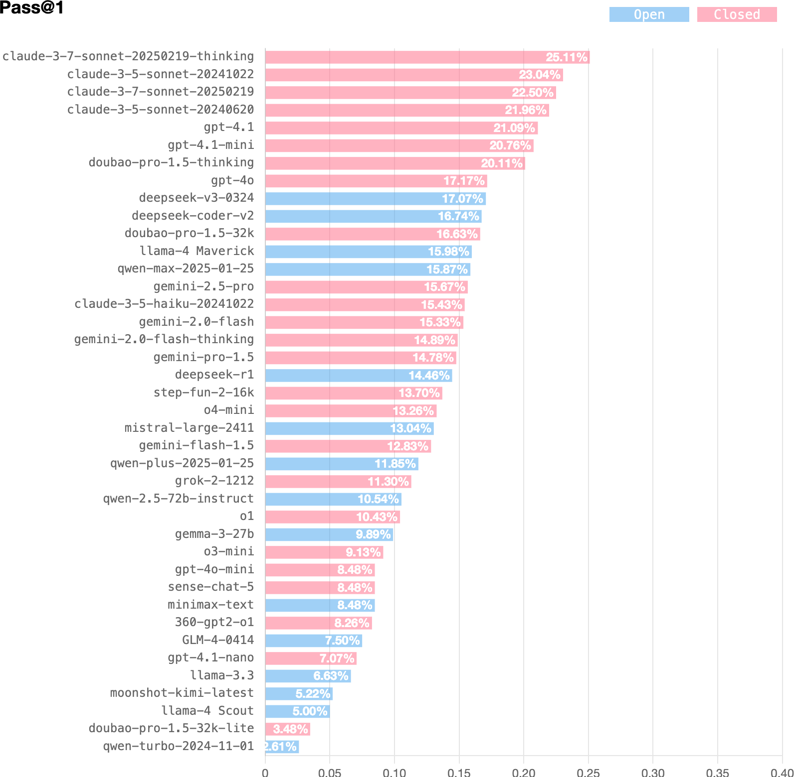
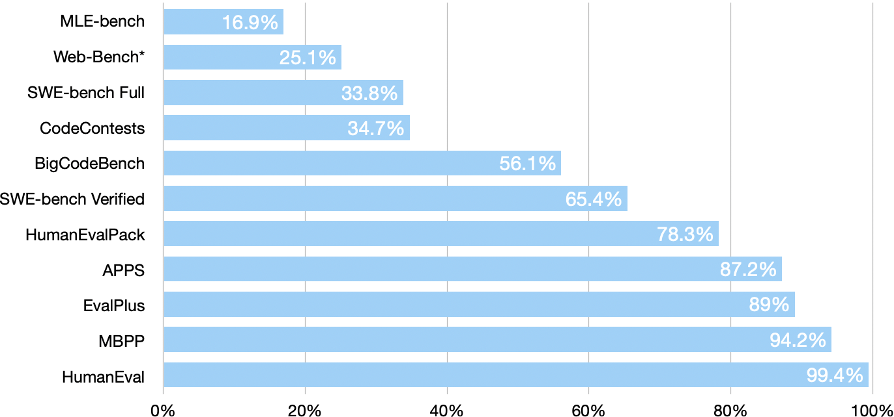

# Web-Bench


<p align="center">
    <a href="./README.zh_CN.md">中文</a> •
    <a href="https://arxiv.org/abs/2505.07473">Paper</a> •
    <a href="https://huggingface.co/datasets/bytedance-research/Web-Bench">Datasets</a> •
    <a href="https://huggingface.co/spaces/bytedance-research/Web-Bench-Leaderboard">LeaderBoard</a> •
    <a href="#-citation">Citation</a>
</p>


## 📖 Overview

**Web-Bench** is a benchmark designed to evaluate the performance of LLMs in actual Web development. Web-Bench contains 50 projects, each consisting of 20 tasks with sequential dependencies. The tasks implement project features in sequence, simulating real-world human development workflows. When designing Web-Bench, we aim to cover the foundational elements of Web development: Web Standards and Web Frameworks. Given the scale and complexity of these projects, which were designed by engineers with 5-10 years of experience, each presents a significant challenge. On average, a single project takes 4–8 hours for a senior engineer to complete. On our given benchmark agent (Web-Agent), SOTA (Claude 3.7 Sonnet) achieves only 25.1\% Pass@1.

The distribution of the experimental data aligns well with the current code generation capabilities of mainstream LLMs.



HumanEval and MBPP have approached saturation. APPS and EvalPlus are approaching saturation. The SOTA for Web-Bench is 25.1\%, which is lower (better) than that of the SWE-bench Full and Verified sets.



## 🚀 Set Up

Web-Bench uses Docker for reproducible evaluations. Refer to the [Docker setup guide](https://docs.docker.com/engine/install/) for instructions on installing Docker on your machine. To run Web-Bench from source, follow these steps:

### Init

```Bash
git clone https://github.com/bytedance/Web-Bench.git

cd Web-Bench
```

### Config

Please check local config files if:

- **Use HTTP-Agent**

  - ` apps/eval/src/config.json5 `, this file must be created locally

    ```json
    {
      "agentMode": "http",
      "agentEndPoint": "http://example.com/path/to/agent"
    }
    ```

- **Use Web-Agent**

  - `apps/eval/src/config.json5`, this file must be created locally

    ```json
    {
      "models": ["claude-3-5-sonnet-20241022", "openai/gpt-4o"],
      "agentMode": "local"
    }
    ```

  - `apps/eval/.env`, this file must be created locally

    ```bash
    ANTHROPIC_API_KEY=xxx
    OPENROUTER_API_KEY=xxx
    # Comment
  
    # OPENAI_API_KEY=xxx
  
    ```
  
    XXX_API_KEY is used in `apps/eval/src/model.json`
  
    ```json
    {
        "models": [
          {
            "model": "claude-3-5-sonnet-20241022",
            "apiKey": "{{ANTHROPIC_API_KEY}}"
          },
          {
            "model": "openai/gpt-4o",
            "apiKey": "{{OPENROUTER_API_KEY}}"
          }
        ]
      }
    ```
  

**Configuration Parameters**

| parameter     | type                                   | default | description                                                  |
| :------------ | :------------------------------------- | :------ | :----------------------------------------------------------- |
| projects      | string[]                               | []      | If empty, all projects will pass.  Value is like "@web-bench/calculator". |
| agentMode     | "local" \| "http"                      | "local" |                                                              |
| agentEndPoint | string                                 | ""      | When agentMode is set to "http", set http API for network requests. |
| models        | string[]                               | []      | 'models' field  in `apps/eval/src/model.json`                |
| maxdop        | number                                 | 30      | max degree of parallelism                                    |
| logLevel      | "info" \| "warn" \| "debug" \| "error" | "info"  |                                                              |
| httpLimit     | number                                 | 10      | When agentMode is set to "http", maximum concurrent requests |

### Build

```bash
docker build -f ./start.dockerfile -t web-bench .
```

## 📘 Usage

```bash
docker run web-bench
```

The eval results will be saved in `app/apps/eval/report` in Docker Container.

## **📌** Q & A

### Difference between Web-Agent and HTTP-Agent

- Web-Agent: Web-Agent has the basic capability to interact with LLM. It can specify the corresponding model in the `apps/eval/src/model.json`.
- HTTP-Agent: Through HTTP-Agent, it calls the configured `agentEndPoint` to send a request to the custom Agent.

### Add new model for evaluation

1. For models deployed on OpenRouter, use the native OpenRouter provider with the following configuration:

```json
{
  "title": "anthropic/claude-3-opus",
  "provider": "openrouter",
  "model": "anthropic/claude-3-opus",
  "apiBase": "https://openrouter.ai/api/v1",
  "apiKey": "{{OPENROUTER_API_KEY}}"
}
```

2. If existing providers do not meet your requirements, you can evaluate specific models by creating a new `Provider`. This is achieved by extending the `BaseLLM`:

   1. ```typescript
      export abstract class BaseLLM {
        abstract provider: string
        abstract option: LLMOption
        info: Model
        abstract chat(
          compiledMessages: ChatMessage[],
          originOptions: CompletionOptions
        ): Promise<{
          request: string
          error?: string
          response: string
        }>
      }
      ```

   2. `option` – define parameters for LLM requests:
   3. ```typescript
      export interface LLMOption {
        contextLength: number
        maxTokens: number
        temperature?: number
        apiBase: string
      }
      ```

   4. `info` – model metadata in `apps/eval/src/model.json`.
   5. `chat` – custom request method that returns the generated text from the LLM.

### Add CustomAgent for evaluation

Web-Bench supports custom Agent capabilities by invoking your custom Agent API through the built-in HTTP-Agent. During the "Call Agent" step, the HTTP-Agent will:

1. Pass the Evaluator's context to your CustomAgent.
2. Return the CustomAgent's response to the Evaluator without modifications.

Therefore, the **request and response formats** of your CustomAgent must adhere to the following interfaces:

```typescript
export interface AgentRequest {
  type: 'normal' | 'init'

  task: string

  // Code files, key is filePath, value is fileContent
  files?: Record<string, string>

  // Error context
  error?: string
}


export interface AgentResponse {
  // Code files, key is filePath, value is fileContent
  files: Record<string, string>

  // [filePath:string]: string  Poor Extension
}
```

## **🛠️** Contribution

* [Project Contribution](https://github.com/bytedance/web-bench/wiki/Project-Contribution)


## **📚** Citation

```bibtex
@article{xu2025webbench,
  title={Web-Bench: A LLM Code Benchmark Based on Web Standards and Frameworks},
  author={Xu, Kai and Mao, YiWei and Guan, XinYi and Feng, ZiLong},
  journal={arXiv preprint arXiv:2505.07473},
  year={2025}
}
```

## **📄** License

[Apache 2.0](./LICENSE.md) 
