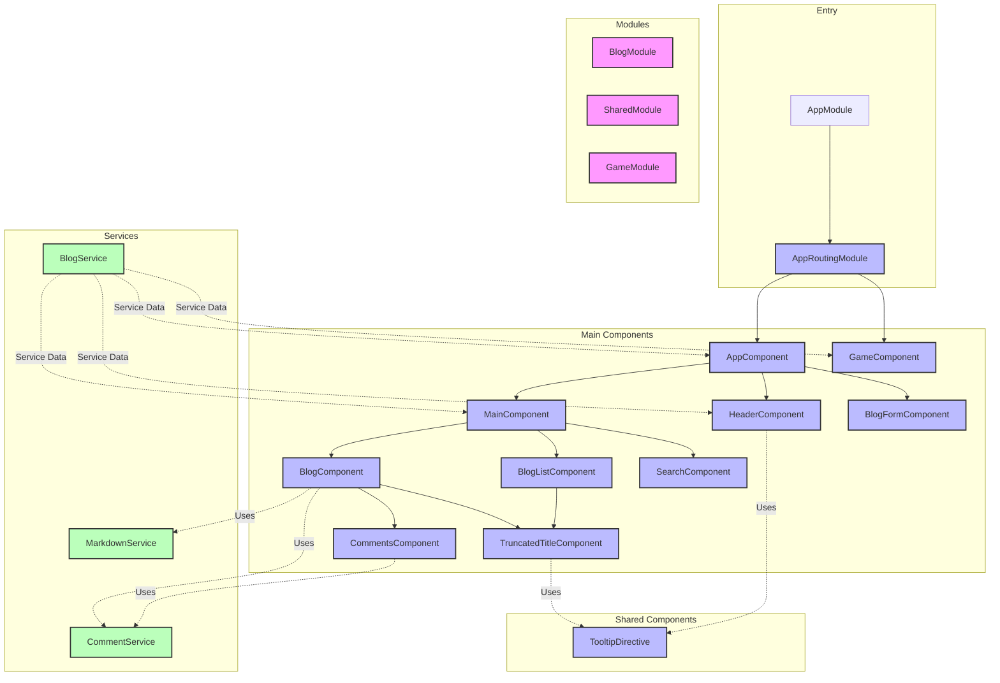

# Angular

## [Evaluate](../readme.md)

## Introduction


**Angular** is a comprehensive framework for building web, mobile and desktop applications. 

Its significance stems from its **robust architecture and full-featured toolkit** that includes everything developers need to build scalable applications.

Angular enables developers to create **powerful components with dependency injection**, and then organize them into **modules to build enterprise-level applications**.

With its **change detection mechanism and Ivy rendering engine**, it efficiently updates and renders components when data changes, resulting in high-performance applications.

As a result, Angular has become an **enterprise-level framework**, widely adopted by **large organizations and businesses worldwide**.

[Angular Github](https://github.com/angular/angular): Star 89k, Fork 24k

## Project Design



This Project creates a blog system to test the ability of LLM to use Angular.

Tasks are designed to verify Agent's knowledge of Angular:

easy:
- Task 1: Create components and use @Input/@Output decorators
- Task 2: NgFor Directive
- Task 3: Component State & Event Binding
- Task 4: Visible-Control (*ngIf)
- Task 5: ngOnInit and Lifecycle Hooks

moderate:
- Task 6: Template-driven Forms 
- Task 7: Services & Dependency Injection
- Task 8: Custom Directive & Delete in List
- Task 9: Reactive Forms & Edit in List & Component Reuse
- Task 10: Filter List & Pure Pipes

challenging:
- Task 11: Virtual Scrolling
- Task 12: Observable State Management
- Task 13: Dynamic Components & ViewChild
- Task 14: SafeHtml Pipe + innerHTML + XSS prevention
- Task 15: Angular CDK Overlay
- Task 16: Custom Structural Directive
- Task 17: ContentChild and ContentChildren
- Task 18: Custom RouteReuseStrategy
- Task 19: Standalone Game Component with NgModules
- Task 20: Route Guards and Resolvers

## Feature Coverage

| API                       | Status |
|---------------------------|--------|
| Component                 | ✅      |
| @Input/@Output           | ✅      |
| Component State          | ✅      |
| Event Binding            | ✅      |
| NgFor                    | ✅      |
| Forms                    | ✅      |
| Custom Directive         | ✅      |
| Services                 | ✅      |
| Lifecycle Hooks          | ✅      |
| ViewChild                | ✅      |
| ContentChild             | ✅      |
| Pipes                    | ✅      |
| Observable               | ✅      |
| Dynamic Components       | ✅      |
| innerHTML                | ✅      |
| XSS Prevention           | ✅      |
| CDK Overlay              | ✅      |
| Change Detection         | ❌      |
| Zone.js                  | ❌      |
| Content Projection       | ✅      |
| Route Guards             | ✅      |
| Lazy Loading            | ❌      |
| NgRx                    | ❌      |

## Development

```bash
cd ./src && ng serve --port 3005
```

## Reference

- [Angular Official Site](https://angular.io/docs)