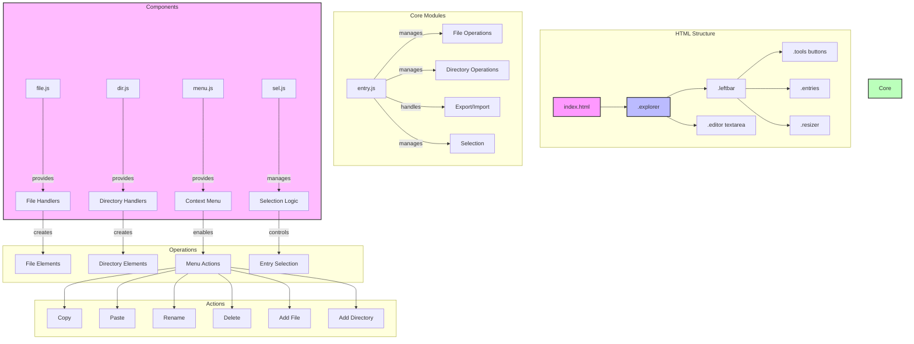

# web-bench-dom

## [Evaluate](../readme.md)

## DOM Introduction

from https://dom.spec.whatwg.org/

> DOM defines a platform-neutral model for events, aborting activities, and node trees.

from https://dom.spec.whatwg.org/#introduction-to-the-dom

> In its original sense, "The DOM" is an API for accessing and manipulating documents (in particular, HTML and XML documents).
>
> Each such document is represented as a [node tree](https://dom.spec.whatwg.org/#concept-node-tree). Some of the [nodes](https://dom.spec.whatwg.org/#concept-node) in a [tree](https://dom.spec.whatwg.org/#concept-tree) can have [children](https://dom.spec.whatwg.org/#concept-tree-child), while others are always leaves.

from https://developer.mozilla.org/en-US/docs/Web/API/Document_Object_Model

> The **Document Object Model** ( **DOM** ) connects web pages to scripts or programming languages by representing the structure of a document—such as the HTML representing a web page—in memory.

Image 1: DOM Tree & HTML

Explore DOM more from this [tool](https://software.hixie.ch/utilities/js/live-dom-viewer/).

### TODO DOM in FE

## Project Design

We will create a minimal File Explorer. In the project, there are 2 entry types including text file and directory.

Typical File Explorer features are:

1. Display Hierarchy Tree
2. Create
3. Delete
4. Rename
5. Modify, file only
6. Move
7. Copy
8. more...

### Tasks

1. Tools
2. Add File
3. Add Dir
4. SelectedEntry
5. Delete Entry
6. Drag and move
7. Context Menu, add an delete Entry, for .entry
8. Context Menu, add an delete Entry, for .entries
9. Context Menu, copy and paste
10. Context Menu, rename
11. Import
12. Export
13. Modify file content
14. Shortcuts, copy/paste/add
15. Shortcuts, delete
16. Generate large entry list
17. Resizer
18. Drag resizer
19. Filter
20. Context Menu, cut

### Project Structure

## DOM Feature Coverage

Image 2: DOM Class Hierarchy (Partially)

| DOM JS API                        | Used |
| --------------------------------- | ---- |
| Document.getElementById()         | ✅   |
| Document.createElement()          | ✅   |
| Document.createEvent()            | -    |
| ParentNode.querySelector()        | ✅   |
| ParentNode.querySelectorAll()     | ✅   |
| ParentNode.children               | ✅   |
| EventTarget.addEventListener()    | ✅   |
| EventTarget.removeEventListener() | -    |
| Node.appendChild()                | ✅   |
| Node.insertBefore()               | ✅   |
| Node.removeChild()                | ✅   |
| Node.replaceChild()               | ✅   |
| Node.hasChildNodes()              | -    |
| Node.textContent                  | ✅   |
| Node.firstChild                   | ✅   |
| Node.lastChild                    | ✅   |
| Node.childNodes                   | ✅   |
| Node.parentNode                   | ✅   |
| Node.nextSibling                  | ✅   |
| Node.previousSibling              | ✅   |
| Element.id                        | ✅   |
| Element.innerHTML                 | ✅   |
| Element.className                 | ✅   |
| Element.classList                 | ✅   |
| Element.clientHeight              | -    |
| Element.clientWidth               | -    |
| Element.scrollHeight              | -    |
| Element.scrollWidth               | -    |
| Element.getAttribute()            | ✅   |
| Element.setAttribute()            | ✅   |
| Element.hasAttribute()            | ✅   |
| Element.removeAttribute()         | -    |
| Element.getElementsByClassName()  | -    |
| Element.getElementsByTagName()    | -    |
| Element.after()                   | ✅   |
| Element.before()                  | -    |
| Element.remove()                  | ✅   |
| Element.closest()                 | ✅   |

## Reference

- [WHATWG - DOM Living Standard](https://dom.spec.whatwg.org/)
- [MDN - Reference](https://developer.mozilla.org/en-US/docs/Web/API/Document_Object_Model)
- [MDN - Tutorial](https://developer.mozilla.org/en-US/docs/Web/API/Document_Object_Model/Examples)
- [DOM in Web-dev Tutorial](https://luics.github.io/web-dev/zh-hans/common/dom.html)
