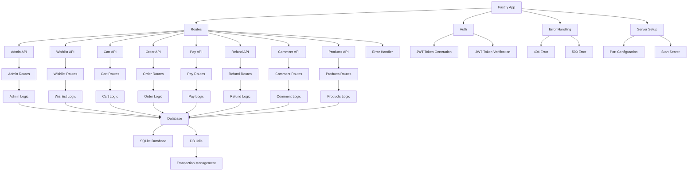

# Fastify E-commerce

## Introduction

**Fastify** is a high-performance, low overhead web framework for Node.js. It's designed with performance in mind and is one of the fastest web frameworks available for Node.js.

Its significance stems from its ability to create **scalable web applications** with features like:

- **Plugin system** for extending functionality
- **Schema-based validation** using JSON Schema
- **Template engines** (EJS in our case) for server-side rendering
- **Static file serving** for better performance
- **Database integration** capabilities

Fastify is becoming increasingly popular for building web applications and APIs due to its outstanding performance and developer experience.

[Fastify Github](https://github.com/fastify/fastify): Star 33+, Fork 2k+

## Third-Party Libraries Used

### EJS Template Engine

**EJS** (Embedded JavaScript) is a simple templating language that lets you generate HTML markup with plain JavaScript.

Key benefits of EJS:

- **Simple Syntax**: Uses plain JavaScript and HTML
- **Fast Development**: No need to learn a new syntax
- **Performance**: Fast compilation and rendering
- **Flexibility**: Full JavaScript support within templates
- **Safety**: Automatic HTML escaping
- **Includes**: Supports includes for better code organization

### Sqlite

**SQLite** is a C-language library that implements a small, fast, self-contained, high-reliability, full-featured, SQL database engine.

For Node.js applications, SQLite offers several key benefits:

- **Zero Configuration**: No separate server process or system configuration required
- **Self-Contained**: The entire SQLite database is stored in a single file
- **Cross-Platform**: Works reliably across all operating systems
- **High Performance**: Excellent performance for most use cases
- **Reliable**: Full ACID compliant transactions
- **Lightweight**: Small memory and disk footprint

The most popular SQLite package for Node.js is [node-sqlite3](https://github.com/TryGhost/node-sqlite3):
Star 6.2k, Fork 946

### JWT

**JSON Web Token (JWT)** is a compact, URL-safe means of representing claims to be transferred between two parties. It is commonly used for **authentication and authorization**.
JWTs are self-contained and self-signed, which means they do not require a separate server or authority to verify the signature. They are stateless, meaning they can be used without the need for a server to store the token.
Some key features of JWTs include:

- **Stateless**: The token can be used without the need for a server to store the token
- **Self-contained**: The token is self-contained and self-signed
- **Compact**: The token is compact and can be easily transmitted over the network
- **Secure**: The token is signed with a secret key, which means it can be verified by the server
- **Scalable**: The token can be used to represent a wide variety of claims

The `panva/jose` library ([Github](https://github.com/panva/jose): Star 3.9k, Fork 200) is a universal JavaScript module for JSON Object Signing and Encryption

## Project Design



Tasks are designed to verify Agent's knowledge of Fastify:

easy:

- Task 1: Basic Router Setup
- Task 2: EJS Layout Template
- Task 3: 404 Page + Links
- Task 4: Basic API Endpoint
- Task 5: List Page with Data Fetching from Sqlite

moderate:

- Task 6: Add Dynamic Routes For Detail Page
- Task 7: Simple JWT Authentication & Cookie
- Task 8: Login Form
- Task 9: Register Form with Data Validation
- Task 10: Static User Profile with Redirect

challenging:

- Task 11: Session-based User Status
- Task 12: CSRF-Protected POST Endpoints
- Task 13: Admin Portal with Role-based Middleware
- Task 14: Wish List Implementation
- Task 15: Shopping Cart with Session
- Task 16: Order Processing
- Task 17: Payment Integration
- Task 18: Refund System
- Task 19: Comment System
- Task 20: Referral System

## Feature Coverage

| Feature               | Status |
| :-------------------- | :----: |
| Routing               |   ✅   |
| Middleware            |   ✅   |
| Static Files          |   ✅   |
| Template Engine (EJS) |   ✅   |
| Error Handling        |   ✅   |
| Session Management    |   ❌   |
| CSRF Protection       |   ❌   |
| File Upload           |   ❌   |
| Database Integration  |   ✅   |
| Authentication        |   ✅   |
| Authorization         |   ✅   |
| API Routes            |   ✅   |
| Form Validation       |   ✅   |
| Cookie Handling       |   ✅   |
| Response Compression  |   ❌   |
| CORS                  |   ❌   |
| Rate Limiting         |   ❌   |
| Logging               |   ❌   |
| Security Headers      |   ❌   |

## Development

```bash
npm run dev
```

## Reference

- [Fastify Documentation](https://www.fastify.io/docs/latest/)
- [EJS Documentation](https://ejs.co/)
