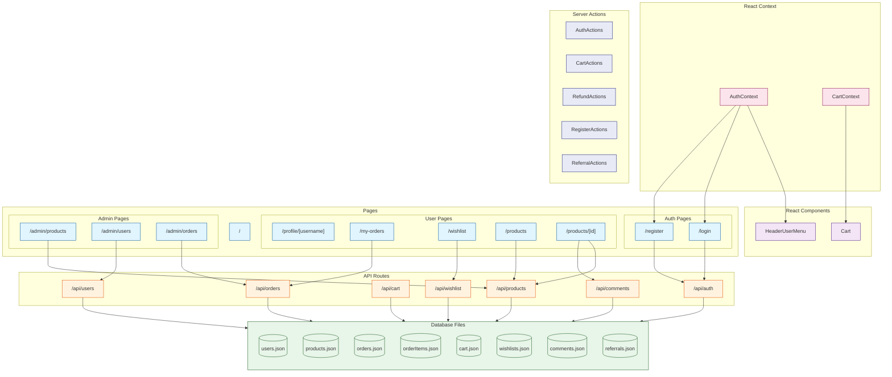

# LowDB

This Project is created based on Project: [nextjs](../nextjs/readme.md)

## Introduction

**LowDB** is a lightweight, simple-to-use JSON file-based database for Node.js and the browser. It stores data in plain JSON files and provides a minimalist API for interacting with your data.

Its significance in modern web development comes from its unique features:

- **Lightweight**: Only ~10KB in size, perfect for small to medium projects
- **Simplicity**: If you know JavaScript, you know how to use LowDB
- **Type Safety**: Full TypeScript support for type checking
- **Plain JavaScript**: Use native JavaScript methods to query and manipulate data
- **Easy Setup**: No complex configuration or server needed
- **Flexibility**: Works in Node.js, Electron, and browser environments
- **Safe Writes**: Atomic file operations to prevent data corruption
- **Adaptable**: Can be extended with custom adapters for different storage formats

LowDB has become a popular choice for **lightweight applications and prototypes**, especially when a full database system would be overkill.

[LowDB Github](https://github.com/typicode/lowdb): Star 22k+, Fork 900+

## Project Design



Tasks are designed to verify Agent's knowledge of LowDB:

easy:

- Task 1: Basic Router (App Router or Page Router)
- Task 2: Read Data from JSON File
- Task 3: Create Data Schema and Initialize JSON Files
- Task 4: Update and Delete Data
- Task 5: List Page with Data Fetching

moderate:

- Task 6: Add Dynamic Routes For Detail Page
- Task 7: Simple JWT Authentication & Cookie
- Task 8: Login
- Task 9: Register
- Task 10: Static User Profile with Redirect

challenging:

- Task 11: User Widget with REALTIME STATUS. Combine React Context Provider & Server Actions.
- Task 12: ACCURATE Number Increment
- Task 13: Add Admin Portals, add middleware to check privileges
- Task 14: Wish List
- Task 15: Cart Functionality
- Task 16: Place Order
- Task 17: Pay Order
- Task 18: Refunds Order
- Task 19: Comment System
- Task 20: Invitation System (Bonus when new User Registered or Pay a New Order)

## Feature Coverage

| API                     | Status |
| :---------------------- | :----: |
| JSONFilePreset          |   ✅   |
| JSONFileSyncPreset      |   ❌   |
| Low                     |   ✅   |
| LowSync                 |   ❌   |
| db.read()               |   ✅   |
| db.write()              |   ✅   |
| db.update()             |   ✅   |
| Custom Adapters Support |   ❌   |

## Development

```bash
npx next dev --port 3005
```

## Reference

- [Next.js Documentation](https://nextjs.org/docs)
- [LowDB Documentation](https://github.com/typicode/lowdb)
- [Next.js Commerce](https://nextjs.org/commerce)
