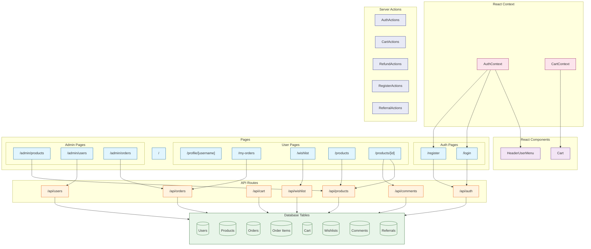

# Next.js E-commerce

## Introduction

**Next.js** is a powerful React framework that enables features like server-side rendering and static site generation for modern web applications.

Its significance stems from its ability to create **high-performance e-commerce experiences** with features like:

- **Server-side rendering** for better SEO and initial page load
- **API Routes** for backend functionality
- **Image Optimization** for better performance
- **Incremental Static Regeneration** for dynamic content

Next.js has become the **go-to framework for building enterprise-level React applications**, especially in e-commerce where performance and SEO are crucial.

[Next.js Github](https://github.com/vercel/next.js): Star 114k, Fork 24.8k

## Third-Party Libraries Used

### Sqlite

**SQLite** is a C-language library that implements a small, fast, self-contained, high-reliability, full-featured, SQL database engine.

For Node.js applications, SQLite offers several key benefits:

- **Zero Configuration**: No separate server process or system configuration required
- **Self-Contained**: The entire SQLite database is stored in a single file
- **Cross-Platform**: Works reliably across all operating systems
- **High Performance**: Excellent performance for most use cases
- **Reliable**: Full ACID compliant transactions
- **Lightweight**: Small memory and disk footprint

The most popular SQLite package for Node.js is [node-sqlite3](https://github.com/TryGhost/node-sqlite3):
Star 6.2k, Fork 946

### JWT

**JSON Web Token (JWT)** is a compact, URL-safe means of representing claims to be transferred between two parties. It is commonly used for **authentication and authorization**.
JWTs are self-contained and self-signed, which means they do not require a separate server or authority to verify the signature. They are stateless, meaning they can be used without the need for a server to store the token.
Some key features of JWTs include:

- **Stateless**: The token can be used without the need for a server to store the token
- **Self-contained**: The token is self-contained and self-signed
- **Compact**: The token is compact and can be easily transmitted over the network
- **Secure**: The token is signed with a secret key, which means it can be verified by the server
- **Scalable**: The token can be used to represent a wide variety of claims

The `panva/jose` library ([Github](https://github.com/panva/jose): Star 3.9k, Fork 200) is a universal JavaScript module for JSON Object Signing and Encryption

## Project Design



Tasks are designed to verify Agent's knowledge of Next.js:

easy:

- Task 1: Basic Router (App Router or Page Router)
- Task 2: Layout
- Task 3: NotFound + Link
- Task 4: Route Handler
- Task 5: List Page with Data Fetching from Sqlite

moderate:

- Task 6: Add Dynamic Routes For Detail Page
- Task 7: Simple JWT Authentication & Cookie
- Task 8: Login Form with Client Component
- Task 9: Register Form with Server Actions
- Task 10: Static User Profile with Redirect

challenging:

- Task 11: User Widget with REALTIME STATUS (Agent might forget it). Combine React Context Provider & Server Actions.
- Task 12: ACCURATE Number Increment with Client Component & Server Actions, update coin displayed STATIC User Profile
- Task 13: Add Admin Portals, add middleware to check privileges
- Task 14: Wish List
- Task 15: Cart Functionality
- Task 16: Place Order
- Task 17: Pay Order
- Task 18: Refunds Order
- Task 19: Comment System
- Task 20: Invitation System (Bonus when new User Registered or Pay a New Order)

## Feature Coverage

| API                                   | Status |
| :------------------------------------ | :----: |
| App Router                            |   ✅   |
| Page Router                           |   ✅   |
| Pages Router                          |   ✅   |
| Layout                                |   ✅   |
| Route Handler                         |   ✅   |
| Redirect                              |   ✅   |
| NotFoundPage                          |   ✅   |
| API Routes                            |   ✅   |
| Dynamic Routes                        |   ✅   |
| Route Groups                          |   ❌   |
| Parallel Routes                       |   ❌   |
| Intercepting Routes                   |   ❌   |
| Static Generation (SSG)               |   ❌   |
| Server-side Rendering (SSR)           |   ✅   |
| Incremental Static Regeneration (ISR) |   ❌   |
| Server Components                     |   ✅   |
| Client Components                     |   ✅   |
| Server Actions                        |   ✅   |
| getStaticProps                        |   ❌   |
| Cookie                                |   ✅   |
| getServerSideProps                    |   ❌   |
| Image Optimization                    |   ❌   |
| Dynamic Imports                       |   ✅   |
| Middleware                            |   ✅   |
| Loading UI                            |   ❌   |
| Error Boundaries                      |   ❌   |
| generateMetadata                      |   ❌   |
| Edge Runtime                          |   ❌   |

## Development

```bash
npx next dev --port 3005
```

## Reference

- [Next.js Documentation](https://nextjs.org/docs)
- [Next.js Commerce](https://nextjs.org/commerce)
