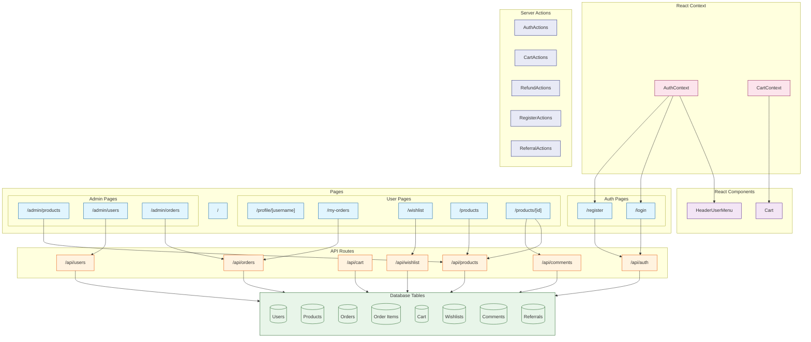

# NoSQL

This Project is created based on Project: [nextjs](../nextjs/readme.md)

## Introduction

**MongoDB** is a popular NoSQL database that provides high performance, high availability, and easy scalability for modern applications.

Its significance in modern web development comes from its unique features:

- **Document-Oriented**: Stores data in flexible, JSON-like documents
- **Scalable**: Horizontal scaling through sharding
- **High Performance**: Rich indexing and aggregation capabilities
- **Real-Time Analytics**: Powerful aggregation framework for data analysis
- **Cloud-Ready**: Easy deployment with MongoDB Atlas

MongoDB has become the **leading NoSQL database choice for enterprise applications**, especially for applications requiring flexible schema and high scalability.

[MongoDB Github](https://github.com/mongodb/mongo): Star 24.1k, Fork 5.3k

## Third-Party Libraries Used

### Mongoose

**Mongoose** is an elegant MongoDB object modeling tool designed for Node.js applications.

Key features that make Mongoose essential for MongoDB development:

- **Schema-Based**: Provides a straight-forward, schema-based solution
- **Built-in TypeChecking**: Automatic type casting and validation
- **Middleware Support**: Pre and post hooks for better control
- **Query Building**: Powerful and intuitive query building API
- **Business Logic Hooks**: Supports methods and statics

[Mongoose Github](https://github.com/Automattic/mongoose): Star 25.9k, Fork 3.8k

## Project Design



Tasks are designed to verify Agent's knowledge of NoSQL:

easy:

- Task 1: Basic Router (App Router or Page Router)
- Task 2: Read Data
- Task 3: Create Model, Create And Read Data
- Task 4: Update, Delete Data
- Task 5: List Page with Data Fetching

moderate:

- Task 6: Add Dynamic Routes For Detail Page
- Task 7: Simple JWT Authentication & Cookie
- Task 8: Login
- Task 9: Register
- Task 10: Static User Profile with Redirect

challenging:

- Task 11: User Widget with REALTIME STATUS (Agent might forget it). Combine React Context Provider & Server Actions.
- Task 12: ACCURATE Number Increment
- Task 13: Add Admin Portals, add middleware to check privileges
- Task 14: Wish List
- Task 15: Cart Functionality
- Task 16: Place Order
- Task 17: Pay Order
- Task 18: Refunds Order
- Task 19: Comment System
- Task 20: Invitation System (Bonus when new User Registered or Pay a New Order)

## Feature Coverage

| API                                   | Status |
| :------------------------------------ | :----: |
| Schema Definition                     |   ✅   |
| Model Creation                        |   ✅   |
| Document Creation (save)              |   ✅   |
| Document Creation (create)            |   ✅   |
| Document Query (find)                 |   ✅   |
| Document Query (findOne)              |   ✅   |
| Document Update (findByIdAndUpdate)   |   ✅   |
| Document Update (findOneAndUpdate)    |   ✅   |
| Document Deletion (findByIdAndDelete) |   ✅   |
| Document Deletion (findOneAndDelete)  |   ✅   |
| Population (Populate)                 |   ✅   |
| Middleware (Pre/Post Hooks)           |   ❌   |
| Virtuals                              |   ❌   |
| Indexes                               |   ✅   |
| Validation                            |   ❌   |
| Aggregation                           |   ❌   |
| Transactions                          |   ✅   |
| Plugins                               |   ❌   |
| Query Building                        |   ❌   |
| Connection Management                 |   ✅   |
| Schema Methods                        |   ❌   |
| Schema Statics                        |   ❌   |
| Schema Query Helpers                  |   ❌   |
| Instance Methods                      |   ❌   |

## Development

```bash
npx next dev --port 3005
```

## Reference

- [Next.js Documentation](https://nextjs.org/docs)
- [Next.js Commerce](https://nextjs.org/commerce)
