# Nuxt.js E-commerce

## Introduction

**Nuxt.js** is a powerful Vue framework that enables features like server-side rendering and static site generation for modern web applications.

Its significance stems from its ability to create **high-performance e-commerce experiences** with features like:

- **Server-side rendering** for better SEO and initial page load
- **API Routes** for backend functionality
- **Image Optimization** for better performance
- **Incremental Static Regeneration** for dynamic content

Nuxt.js has become the **go-to framework for building enterprise-level Vue applications**, especially in e-commerce where performance and SEO are crucial.

[Nuxt.js Github](https://github.com/nuxt/nuxt): Star 50.2k, Fork 4.3k

## Third-Party Libraries Used

### Sqlite

**SQLite** is a C-language library that implements a small, fast, self-contained, high-reliability, full-featured, SQL database engine.

For Node.js applications, SQLite offers several key benefits:

- **Zero Configuration**: No separate server process or system configuration required
- **Self-Contained**: The entire SQLite database is stored in a single file
- **Cross-Platform**: Works reliably across all operating systems
- **High Performance**: Excellent performance for most use cases
- **Reliable**: Full ACID compliant transactions
- **Lightweight**: Small memory and disk footprint

The most popular SQLite package for Node.js is [node-sqlite3](https://github.com/TryGhost/node-sqlite3):
Star 6.2k, Fork 946

### JWT

**JSON Web Token (JWT)** is a compact, URL-safe means of representing claims to be transferred between two parties. It is commonly used for **authentication and authorization**.
JWTs are self-contained and self-signed, which means they do not require a separate server or authority to verify the signature. They are stateless, meaning they can be used without the need for a server to store the token.
Some key features of JWTs include:

- **Stateless**: The token can be used without the need for a server to store the token
- **Self-contained**: The token is self-contained and self-signed
- **Compact**: The token is compact and can be easily transmitted over the network
- **Secure**: The token is signed with a secret key, which means it can be verified by the server
- **Scalable**: The token can be used to represent a wide variety of claims

The `panva/jose` library ([Github](https://github.com/panva/jose): Star 3.9k, Fork 200) is a universal JavaScript module for JSON Object Signing and Encryption

## Project Design

```mermaid
graph TD
    subgraph Components["Vue Components"]
        HeaderUserMenu["HeaderUserMenu"]
        CartComponent["Cart"]
    end

    subgraph Store["Vuex Store"]
        AuthStore["AuthStore"]
        CartStore["CartStore"]
    end

    subgraph Pages["Pages"]
        direction TB
        Root["/"]

        subgraph Auth["Auth Pages"]
            Login["/login"]
            Register["/register"]
        end

        subgraph User["User Pages"]
            Profile["/profile/[username]"]
            MyOrders["/my-orders"]
            Wishlist["/wishlist"]
            ProductsList["/products"]
            ProductDetail["/products/[id]"]
        end

        subgraph Admin["Admin Pages"]
            AdminProducts["/admin/products"]
            AdminUsers["/admin/users"]
            AdminOrders["/admin/orders"]
        end
    end

    subgraph Server["Server Routes"]
        AuthRoutes["/api/auth"]
        ProductsRoutes["/api/products"]
        CartRoutes["/api/cart"]
        WishlistRoutes["/api/wishlist"]
        OrdersRoutes["/api/orders"]
        CommentsRoutes["/api/comments"]
        UsersRoutes["/api/users"]
    end

    subgraph Database["Database Tables"]
        direction TB
        Users[(Users)]
        Products[(Products)]
        Orders[(Orders)]
        OrderItems[(Order Items)]
        Cart[(Cart)]
        Wishlists[(Wishlists)]
        Comments[(Comments)]
        Referrals[(Referrals)]
    end

    %% Store & Components Relations
    AuthStore --> HeaderUserMenu
    AuthStore --> Login
    AuthStore --> Register
    CartStore --> CartComponent

    %% Pages to Server Relationships
    Login --> AuthRoutes
    Register --> AuthRoutes
    ProductsList --> ProductsRoutes
    ProductDetail --> ProductsRoutes
    ProductDetail --> CommentsRoutes
    Wishlist --> WishlistRoutes
    MyOrders --> OrdersRoutes
    AdminProducts --> ProductsRoutes
    AdminUsers --> UsersRoutes
    AdminOrders --> OrdersRoutes

    %% Server to Database Relationships
    AuthRoutes --> Database
    ProductsRoutes --> Database
    CartRoutes --> Database
    WishlistRoutes --> Database
    OrdersRoutes --> Database
    CommentsRoutes --> Database
    UsersRoutes --> Database

    classDef pageClass fill:#e1f5fe,stroke:#01579b
    classDef apiClass fill:#fff3e0,stroke:#e65100
    classDef dbClass fill:#e8f5e9,stroke:#1b5e20
    classDef componentClass fill:#f3e5f5,stroke:#4a148c
    classDef storeClass fill:#fce4ec,stroke:#880e4f
    classDef serverClass fill:#e8eaf6,stroke:#1a237e

    class Root,Login,Register,Profile,MyOrders,Wishlist,ProductsList,ProductDetail,AdminProducts,AdminUsers,AdminOrders pageClass
    class AuthRoutes,ProductsRoutes,CartRoutes,WishlistRoutes,OrdersRoutes,CommentsRoutes,UsersRoutes apiClass
    class Users,Products,Orders,OrderItems,Cart,Wishlists,Comments,Referrals,Database dbClass
    class CartComponent,HeaderUserMenu componentClass
    class AuthStore,CartStore storeClass
    class Server serverClass
```



## Feature Coverage

| Feature                               | Status |
| :------------------------------------ | :----: |
| Pages                                 |   ✅   |
| Layout                                |   ✅   |
| Middleware                            |   ✅   |
| Server Routes                         |   ✅   |
| Dynamic Routes                        |   ✅   |
| Route Groups                          |   ❌   |
| Static Generation (SSG)               |   ❌   |
| Server-side Rendering (SSR)           |   ✅   |
| Incremental Static Regeneration (ISR) |   ❌   |
| Server Components                     |   ✅   |
| Client Components                     |   ✅   |
| Vuex Store                            |   ✅   |
| Cookie                                |   ✅   |
| Image Optimization                    |   ❌   |
| Dynamic Imports                       |   ✅   |
| Loading UI                            |   ❌   |
| Error Boundaries                      |   ❌   |
| Meta Tags                             |   ❌   |
| Edge Runtime                          |   ❌   |

## Development
·
```bash
npm run dev
```

## Reference

- [Nuxt.js Documentation](https://nuxt.com/docs)
- [Nuxt.js Commerce](https://nuxt.com/commerce)
