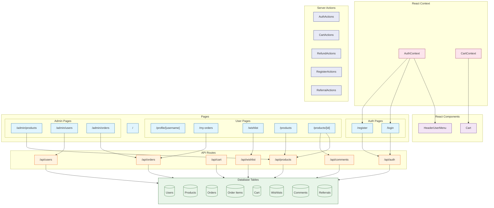

# Prisma

This Project is created based on Project: [nextjs](../nextjs/readme.md)

## Introduction

**Prisma** is a modern, type-safe ORM for Node.js and TypeScript that provides a high-level abstraction for interacting with databases including PostgreSQL, MySQL, SQLite, SQL Server, MongoDB, and CockroachDB.

Its significance in modern web development comes from its unique features:

- **Type Safety**: Full TypeScript support with auto-generated client
- **Schema Definition**: Define your database schema using Prisma Schema Language (PSL)
- **Migrations**: Auto-generated SQL migrations with a declarative approach
- **Fluent API**: Intuitive and type-safe query building
- **Relations**: Easily define and manage relationships between models
- **Transactions**: Support for atomic operations and data integrity
- **Prisma Studio**: Visual database editor for browsing and modifying data

Prisma has rapidly become the **leading ORM choice for TypeScript applications**, especially for applications requiring type safety, robust database interactions, and maintainable code.

[Prisma Github](https://github.com/prisma/prisma): Star 35k+, Fork 1.2k+

## Project Design



Tasks are designed to verify Agent's knowledge of Prisma:

easy:

- Task 1: Basic Router (App Router or Page Router)
- Task 2: Read Data
- Task 3: Create Schema, Create And Read Data
- Task 4: Update, Delete Data
- Task 5: List Page with Data Fetching

moderate:

- Task 6: Add Dynamic Routes For Detail Page
- Task 7: Simple JWT Authentication & Cookie
- Task 8: Login
- Task 9: Register
- Task 10: Static User Profile with Redirect

challenging:

- Task 11: User Widget with REALTIME STATUS. Combine React Context Provider & Server Actions.
- Task 12: ACCURATE Number Increment
- Task 13: Add Admin Portals, add middleware to check privileges
- Task 14: Wish List
- Task 15: Cart Functionality
- Task 16: Place Order
- Task 17: Pay Order
- Task 18: Refunds Order
- Task 19: Comment System
- Task 20: Invitation System (Bonus when new User Registered or Pay a New Order)

## Feature Coverage

| API                            | Status |
| :----------------------------- | :----: |
| Schema Definition              |   ✅   |
| Model Creation (Prisma Client) |   ✅   |
| Document Creation (create)     |   ✅   |
| Document Creation (createMany) |   ✅   |
| Document Query (findMany)      |   ✅   |
| Document Query (findUnique)    |   ✅   |
| Document Update (update)       |   ✅   |
| Document Update (updateMany)   |   ✅   |
| Document Deletion (delete)     |   ✅   |
| Document Deletion (deleteMany) |   ✅   |
| Relations (include)            |   ✅   |
| Middlewares                    |   ❌   |
| Computed Fields                |   ❌   |
| Indexes                        |   ❌   |
| Validation                     |   ❌   |
| Aggregation                    |   ❌   |
| Transactions ($transaction)    |   ✅   |
| Extensions                     |   ❌   |
| Raw Database Access            |   ❌   |
| Connection Management          |   ❌   |
| Fluent API                     |   ❌   |
| Nested Writes                  |   ❌   |
| Query Filters                  |   ❌   |

## Development

```bash
npx next dev --port 3005
```

## Reference

- [Next.js Documentation](https://nextjs.org/docs)
- [Prisma Documentation](https://www.prisma.io/docs)
- [Next.js Commerce](https://nextjs.org/commerce)
