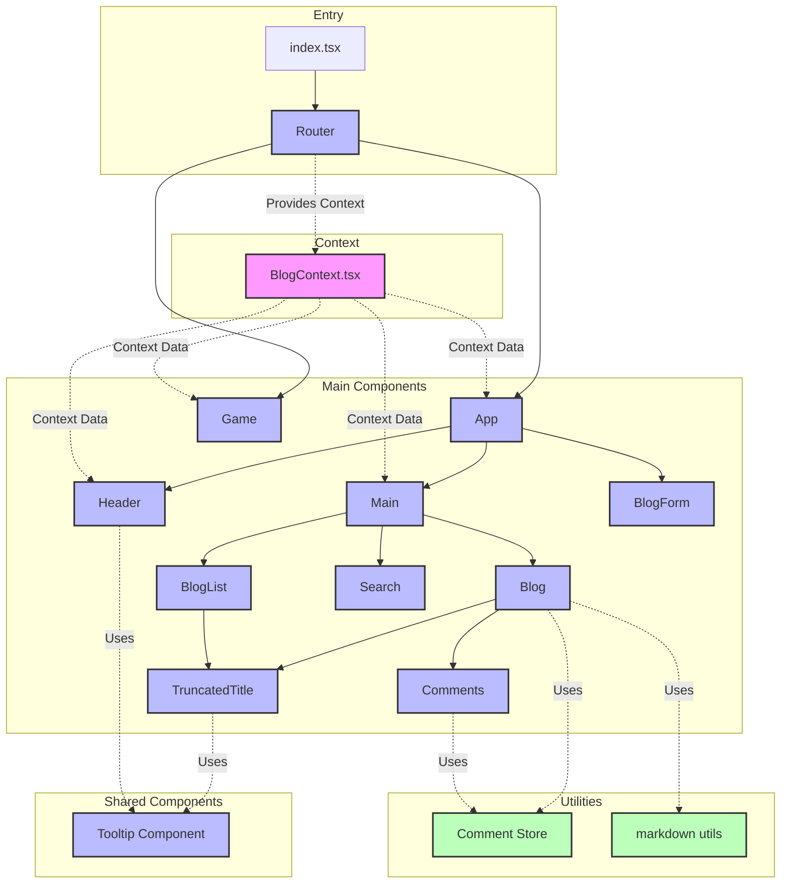

# React

## [Evaluate](../readme.md)

## Introduction

**React** is the most popular library for building web and native user interfaces.

Its significance stems from its efficiency in **creating dynamic and interactive user experiences across platforms**.

React allows developers to **build encapsulated components that manage their own state**, and then compose them to **make complex user interfaces**.

With a **virtual DOM feature**, it efficiently updates and renders the right components when data changes, leading to performant and responsive applications.

As a result, React has become an **industry standard for front-end development**, powering **millions of websites and applications**.

[React Github](https://github.com/facebook/react): Star 229k, Fork 47k

## Project Design



This Project create a blog system to test the ability of LLM to use React.js.

Tasks is designed to verify Agent's knowledge of React.js:

easy:

- Task 1: Create components and use props
- Task 2: List Rendering
- Task 3: State & Event
- Task 4: Visible-Control (Modal)
- Task 5: useEffect

moderate:

- Task 6: Form Handling
- Task 7: React Context API
- Task 8: Custom Hook & Delete in List State
- Task 9: Custom Hook & Edit in List State & Reuse of CreateForm
- Task 10: Filter List & useMemo

chanllenging:

- Task 11: Virtual List
- Task 12: useSyncExternalStore
- Task 13: ReactPortal & useRef (Tooltip)
- Task 14: Markdown + dangerouslySetInnerHTML + XSS prevention
- Task 15: ReactDOM API (showToast)
- Task 16: Encapsulate Component (TextOverflow) and reuse it, Tooltip might hijack the ref of the first div
- Task 17: use forwardRef and useImperativeHandle to Pass Ref between multiple Components
- Task 18: write a simple React Router
- Task 19: write a complete game, modify existed component to show customized toast (in task-15)
- Task 20: Communication between pages.

## Feature Coverage

| API                     | Status |
| ----------------------- | ------ |
| Component               | ✅     |
| Props                   | ✅     |
| State                   | ✅     |
| Event                   | ✅     |
| List                    | ✅     |
| Form                    | ✅     |
| Custom Hook             | ✅     |
| Context API             | ✅     |
| useEffect               | ✅     |
| useRef                  | ✅     |
| useCallback             | ✅     |
| useMemo                 | ✅     |
| useSyncExternalStore    | ✅     |
| createPortal            | ✅     |
| dangerouslySetInnerHTML | ✅     |
| XSS Prevention          | ✅     |
| React DOM API           | ✅     |
| startTransition         | ❌     |
| useDeferredValue        | ❌     |
| forwardRef              | ✅     |
| useImperativeHandle     | ✅     |
| lazy                    | ❌     |
| memo                    | ❌     |

## Development

https://create-react-app.dev/docs/getting-started

```
npx vite src --port 3005
```

## Reference

- [React Official Site](https://react.dev/learn)
