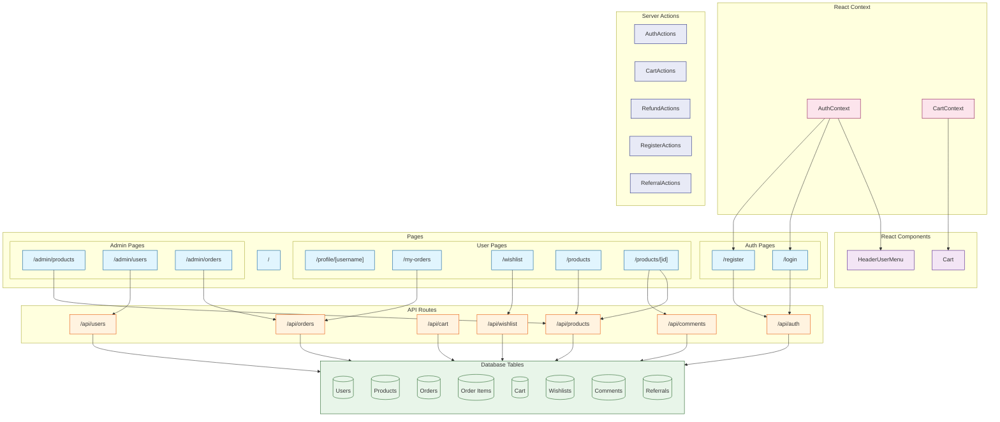

# Sequelize

This Project is created based on Project: [nextjs](../nextjs/readme.md)

## Introduction

**Sequelize** is a powerful Object-Relational Mapping (ORM) library for Node.js that provides a high-level abstraction for interacting with relational databases like PostgreSQL, MySQL, SQLite, and MSSQL.

Its significance in modern web development comes from its unique features:

- **Multi-Database Support**: Works seamlessly with multiple relational databases
- **Model Definition**: Define models with a simple, declarative syntax
- **Migrations**: Manage database schema changes with ease
- **Query Building**: Build complex queries using a fluent API
- **Associations**: Easily define and manage relationships between models
- **Transactions**: Support for atomic operations and data integrity

Sequelize has become the **leading ORM choice for Node.js applications**, especially for applications requiring robust database interactions and maintainable code.

[Sequelize Github](https://github.com/sequelize/sequelize): Star 29.3k, Fork 4.5k

## Project Design



Tasks are designed to verify Agent's knowledge of Sequelize:

easy:

- Task 1: Basic Router (App Router or Page Router)
- Task 2: Read Data
- Task 3: Create Model, Create And Read Data
- Task 4: Update, Delete Data
- Task 5: List Page with Data Fetching

moderate:

- Task 6: Add Dynamic Routes For Detail Page
- Task 7: Simple JWT Authentication & Cookie
- Task 8: Login
- Task 9: Register
- Task 10: Static User Profile with Redirect

challenging:

- Task 11: User Widget with REALTIME STATUS (Agent might forget it). Combine React Context Provider & Server Actions.
- Task 12: ACCURATE Number Increment
- Task 13: Add Admin Portals, add middleware to check privileges
- Task 14: Wish List
- Task 15: Cart Functionality
- Task 16: Place Order
- Task 17: Pay Order
- Task 18: Refunds Order
- Task 19: Comment System
- Task 20: Invitation System (Bonus when new User Registered or Pay a New Order)

## Feature Coverage

| API                                  | Status |
| :----------------------------------- | :----: |
| Schema Definition (Model Definition) |   ✅   |
| Model Creation                       |   ✅   |
| Document Creation (create)           |   ✅   |
| Document Creation (bulkCreate)       |   ✅   |
| Document Query (findAll)             |   ✅   |
| Document Query (findOne)             |   ✅   |
| Document Update (update)             |   ✅   |
| Document Update (findOneAndUpdate)   |   ✅   |
| Document Deletion (destroy)          |   ✅   |
| Document Deletion (findOneAndDelete) |   ✅   |
| Association (Include)                |   ✅   |
| Hooks (Before/After Hooks)           |   ❌   |
| Virtual Fields                       |   ❌   |
| Indexes                              |   ✅   |
| Validation                           |   ❌   |
| Aggregation                          |   ❌   |
| Transactions                         |   ✅   |
| Plugins                              |   ❌   |
| Query Building                       |   ❌   |
| Connection Management                |   ✅   |
| Model Methods                        |   ❌   |
| Model Statics                        |   ❌   |
| Scopes                               |   ❌   |
| Instance Methods                     |   ❌   |

## Development

```bash
npx next dev --port 3005
```

## Reference

- [Next.js Documentation](https://nextjs.org/docs)
- [Next.js Commerce](https://nextjs.org/commerce)
