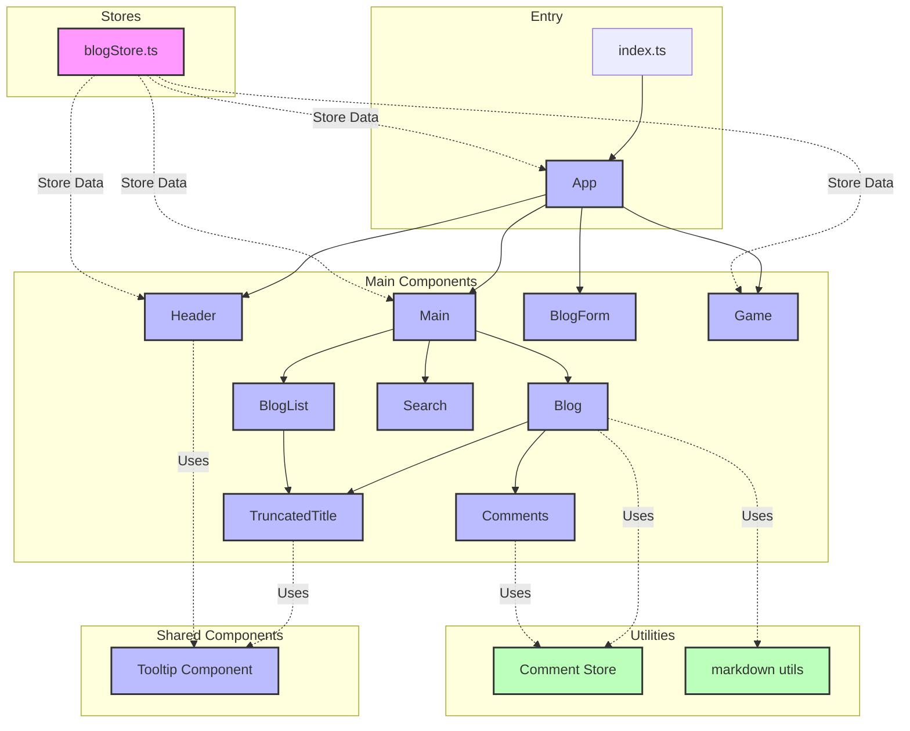

# Svelte

## [Evaluate](../readme.md)

## Introduction

**Svelte** is an innovative framework for building user interfaces.

Its significance comes from its **compile-time approach to building highly performant user interfaces**.

Svelte takes a unique approach by **compiling components into efficient vanilla JavaScript at build time**, rather than interpreting code at runtime like other frameworks.

With its **reactive system**, it automatically updates the DOM without a virtual DOM, resulting in smaller bundle sizes and better runtime performance.

As a result, Svelte has become an **emerging choice for modern front-end development**, powering **everything from small applications to large-scale websites**.

[Svelte Github](https://github.com/sveltejs/svelte): Star 75.8k, Fork 4k

## Project Design



This Project creates a blog system to test the ability of LLM to use Svelte.

Tasks are designed to verify Agent's knowledge of Svelte:

easy:

- Task 1: Create components and use props
- Task 2: List Rendering
- Task 3: State & Events
- Task 4: Visible-Control (Modal)
- Task 5: Lifecycle functions

moderate:

- Task 6: Form Handling
- Task 7: Svelte Stores
- Task 8: Custom Store & Delete in List State
- Task 9: Custom Store & Edit in List State & Reuse of CreateForm
- Task 10: Filter List & Derived Stores

challenging:

- Task 11: Virtual List
- Task 12: Custom Store Implementation
- Task 13: Portal & Binding (Tooltip)
- Task 14: Markdown + {@html} + XSS prevention
- Task 15: Custom Event Dispatch (showToast)
- Task 16: Encapsulate Component (TextOverflow) and reuse it, handle Tooltip binding issues
- Task 17: Use bind:this to Pass References between multiple Components
- Task 18: Write a simple routing system
- Task 19: Write a complete game, modify existed component to show customized toast (in task-15)
- Task 20: Communication between pages

## Feature Coverage

| API                 | Status |
| ------------------- | ------ |
| Component           | ✅     |
| Props               | ✅     |
| Reactive Statements | ✅     |
| Event Handling      | ✅     |
| Each Blocks         | ✅     |
| Form Bindings       | ✅     |
| Custom Stores       | ✅     |
| Svelte Stores       | ✅     |
| Lifecycle           | ✅     |
| bind:this           | ✅     |
| Event Forwarding    | ✅     |
| Derived Stores      | ✅     |
| Custom Store        | ✅     |
| Portal              | ✅     |
| {@html}             | ✅     |
| XSS Prevention      | ✅     |
| Custom Events       | ✅     |
| Transitions         | ✅     |
| Animations          | ✅     |
| Actions             | ✅     |
| Slots               | ❌     |
| Context API         | ❌     |

## Development

```bash
npm start
```

## Reference

- [Svelte Official Site](https://svelte.dev/docs)
