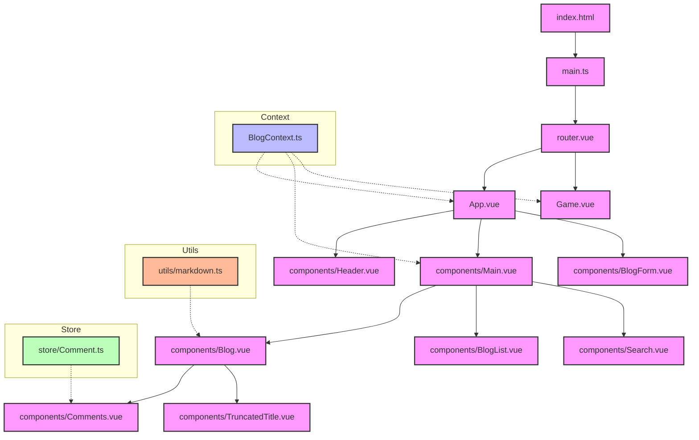

# Vue

## [Evaluate](../readme.md)

## Introduction

**Vue** is a progressive framework for building user interfaces on the web.

Its significance stems from its **approachable, versatile, and performant** nature in **building modern web applications**.

Vue allows developers to create **reusable components with a template syntax** that combines HTML with component logic, and features a **reactivity system** that automatically keeps the DOM in sync with the application state.

With its **virtual DOM implementation** and **reactive dependency tracking**, Vue efficiently handles UI updates while maintaining excellent performance.

As a result, Vue has become one of the **most popular front-end frameworks**, widely adopted by developers and enterprises worldwide.

[Vue Github](https://github.com/vuejs/core): Star 205k, Fork 34k

## Project Design



This Project creates a blog system to test the ability of LLM to use Vue.js.

Tasks are designed to verify Agent's knowledge of Vue.js:

easy:

- Task 1: Create components and use props
- Task 2: List Rendering (v-for)
- Task 3: State & Event (ref/reactive & v-on)
- Task 4: Visible-Control (Modal with v-if/v-show)
- Task 5: watch/watchEffect

moderate:

- Task 6: Form Handling (v-model)
- Task 7: Provide/Inject API
- Task 8: Composables & Delete in List State
- Task 9: Composables & Edit in List State & Reuse of CreateForm
- Task 10: Filter List & computed

challenging:

- Task 11: Virtual List
- Task 12: Custom Reactivity
- Task 13: Teleport & Template Refs
- Task 14: Markdown + v-html + XSS prevention
- Task 15: Global Methods (Toast)
- Task 16: Encapsulate Component (TextOverflow) and reuse it
- Task 17: use defineExpose and Custom Directives to handle refs
- Task 18: write a simple Vue Router
- Task 19: write a complete game, modify existed component to show customized toast
- Task 20: Communication between pages

## Feature Coverage

| API                  | Status |
| -------------------- | ------ |
| Component            | ✅     |
| Props                | ✅     |
| State (ref/reactive) | ✅     |
| Event                | ✅     |
| List (v-for)         | ✅     |
| Form (v-model)       | ✅     |
| Composables          | ✅     |
| Provide/Inject       | ✅     |
| watch/watchEffect    | ✅     |
| Template Refs        | ✅     |
| computed             | ✅     |
| Custom Reactivity    | ✅     |
| Teleport             | ✅     |
| v-html               | ✅     |
| XSS Prevention       | ✅     |
| Global Methods       | ✅     |
| Suspense             | ❌     |
| defineExpose         | ✅     |
| Custom Directives    | ✅     |
| defineAsyncComponent | ❌     |
| defineOptions        | ❌     |

## Development

```
npx vite src --port 3005
```

## Reference

- [React Official Site](https://react.dev/learn)
